# Инструкция Android Happ

1) **Скачать Happ.**

Открываем **страницу подписки** remnavawe, которую вам скинул админ, в браузере на телефоне.

Пример ссылки: `https://webhooks.techbridge-net.com/ваш_код`

> ⚠️ **Подписка рассчитана на 5 устройств.** Добавить её на шестое устройство не получится. Если нужно больше — обратитесь к админу.

В разделе **«Установка»** убедитесь, что выбрана платформа **Android** и вкладка **Happ**.

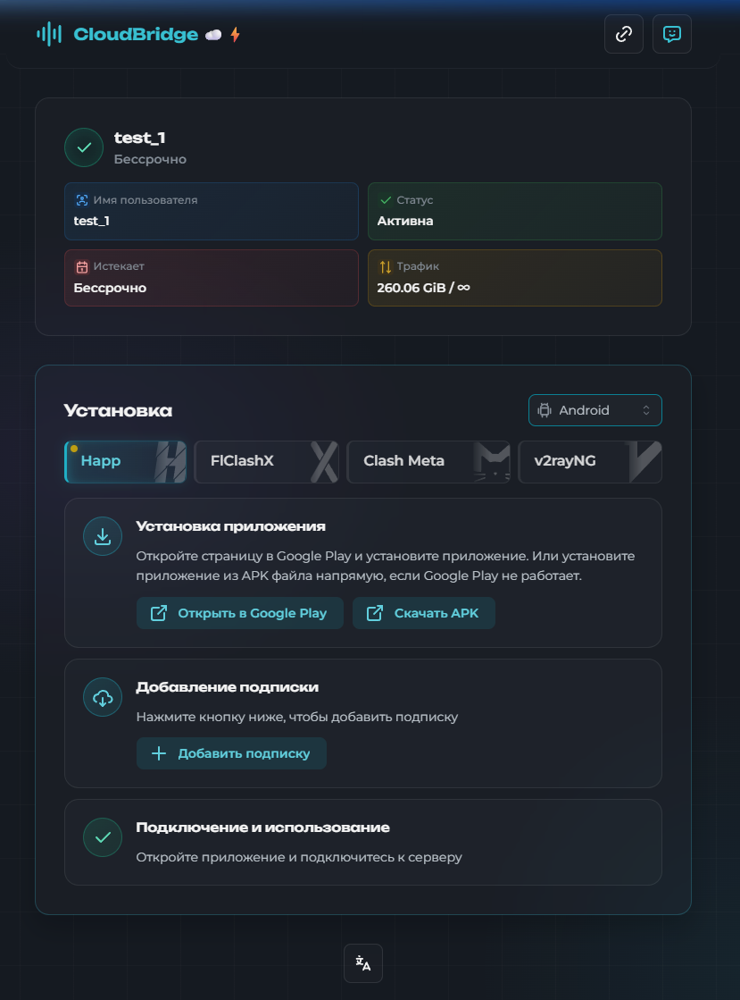

Нажмите **«Открыть в Google Play»** и установите приложение.

> Если Google Play не работает — нажмите **«Скачать APK»** и установите из файла. Возможно, потребуется разрешить установку из неизвестных источников в настройках телефона.

2) Запускаем **Happ**.

При первом запуске приложение спросит разрешение на уведомления - жмём **«Разрешить»**.

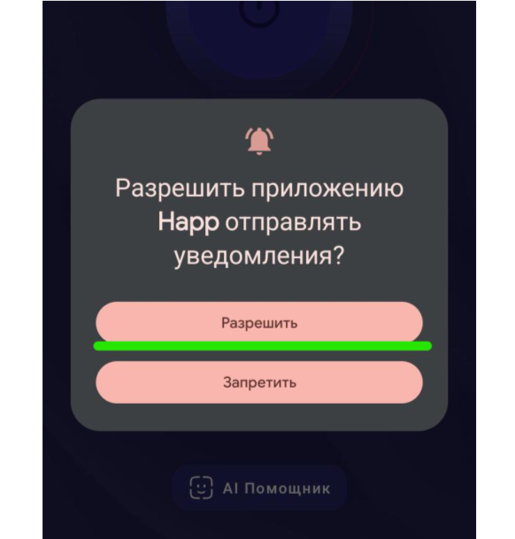

Откроется главное окно с большой кнопкой подключения.

3) Теперь нужно добавить подписку.

Возвращаемся на **страницу подписки** remnavawe в браузере.

Находим раздел **«Добавление подписки»** и жмём **«+ Добавить подписку»**.

Подписка автоматически добавится в Happ.

> **Альтернативный способ:** скопируйте ссылку-подписку и в приложении Happ нажмите **«Из буфера»**. Либо можно отсканировать **QR‑код** кнопкой **«QR-Код»**.

4) Добавятся конфиги — список серверов.

Вы увидите подключения по разным странам и протоколам, например:
- **[Автовыбор]** — сам выбирает лучший сервер, а если связь пропадёт — автоматически переключится на другую рабочую ноду
- **[FR] Reality**, **[FR] WS**, **[FR] XHTTP** — серверы во Франции  
- **[SW] Reality**, **[SW] WS**, **[SW] XHTTP** — серверы в Швеции
- и другие

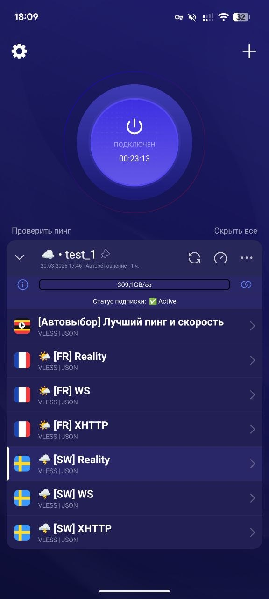

**Рекомендуем использовать [Автовыбор]** — вам не придётся вручную менять сервер, всё работает само.

Нужный **конфиг выбираем** и нажимаем на большую кнопку **подключиться**.

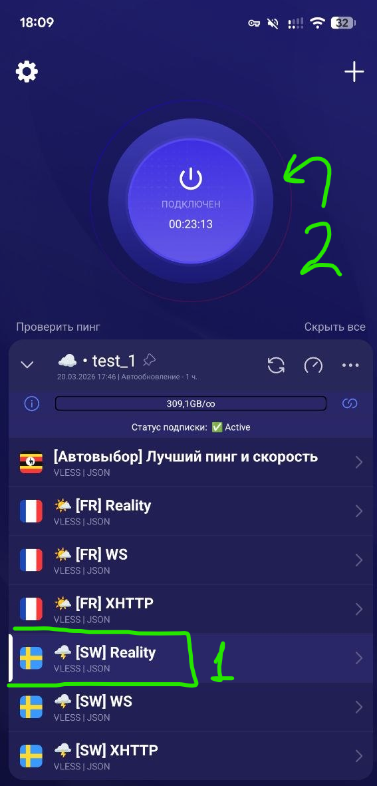

5) Проверяем, что VPN работает: заходим на [https://www.whatismyip.com/](https://www.whatismyip.com/) — страна должна быть **не Россия** (Франция, Швеция, Германия и т.д.).

6) Чтобы **отключить VPN** — нажимаем на большую кнопку ещё раз.

---
## Можно сразу настроить маршрутизацию, чтоб ру-сайты, открывались напрямую:

**Функция экспериментальная, попробуйте, если не будет работать - просто отключите.**

1) Открываем правила маршрутизации:

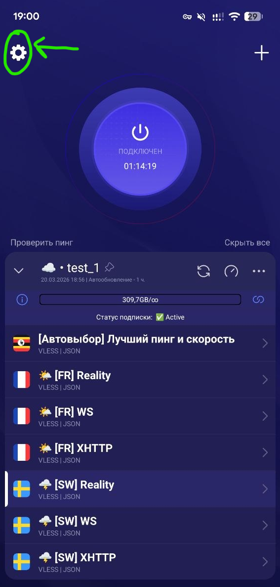 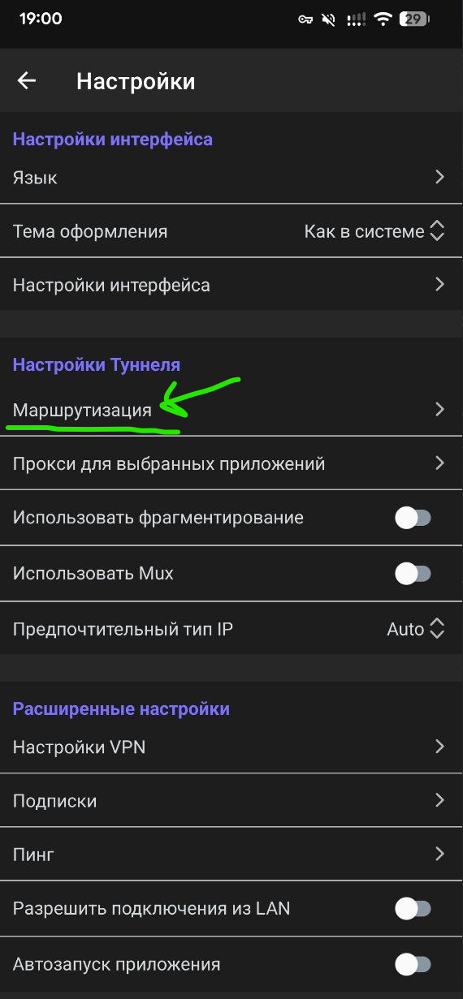

2) Копируем на выбор одну из строк ниже.

**Только ру сайты напрямую:**
[happ://routing/add/ewogICAgIkJsb2NrSXAiOiBbXSwKICAgICJCbG9ja1NpdGVzIjogW10sCiAgICAiRGlyZWN0SXAiOiBbCiAgICAgICAgImdlb2lwOnJ1IiwKICAgICAgICAiMTAuMC4wLjAvOCIsCiAgICAgICAgIjE3Mi4xNi4wLjAvMTIiLAogICAgICAgICIxOTIuMTY4LjAuMC8xNiIsCiAgICAgICAgIjE2OS4yNTQuMC4wLzE2IiwKICAgICAgICAiMjI0LjAuMC4wLzQiLAogICAgICAgICIyNTUuMjU1LjI1NS4yNTUiCiAgICBdLAogICAgIkRuc0hvc3RzIjogewogICAgICAgICJjbG91ZGZsYXJlLWRucy5jb20iOiAiMS4xLjEuMSIKICAgIH0sCiAgICAiRG9tYWluU3RyYXRlZ3kiOiAiSVBJZk5vbk1hdGNoIiwKICAgICJEb21lc3RpY0ROU0RvbWFpbiI6ICJodHRwczovL2Rucy5nb29nbGUvZG5zLXF1ZXJ5IiwKICAgICJEb21lc3RpY0ROU0lQIjogIjc3Ljg4LjguOCIsCiAgICAiRG9tZXN0aWNETlNUeXBlIjogIkRvVSIsCiAgICAiRmFrZUROUyI6ICJmYWxzZSIsCiAgICAiR2VvaXB1cmwiOiAiaHR0cHM6Ly9naXRodWIuY29tL0xveWFsc29sZGllci92MnJheS1ydWxlcy1kYXQvcmVsZWFzZXMvbGF0ZXN0L2Rvd25sb2FkL2dlb2lwLmRhdCIsCiAgICAiR2Vvc2l0ZXVybCI6ICJodHRwczovL2dpdGh1Yi5jb20vTG95YWxzb2xkaWVyL3YycmF5LXJ1bGVzLWRhdC9yZWxlYXNlcy9sYXRlc3QvZG93bmxvYWQvZ2Vvc2l0ZS5kYXQiLAogICAgIkdsb2JhbFByb3h5IjogInRydWUiLAogICAgIkxhc3RVcGRhdGVkIjogMTc2NDMyMDc0MywKICAgICJQcm94eUlwIjogW10sCiAgICAiUHJveHlTaXRlcyI6IFtdLAogICAgIlJlbW90ZUROU0RvbWFpbiI6ICJodHRwczovL2Nsb3VkZmxhcmUtZG5zLmNvbS9kbnMtcXVlcnkiLAogICAgIlJlbW90ZUROU0lQIjogIjEuMS4xLjEiLAogICAgIlJlbW90ZUROU1R5cGUiOiAiRG9IIiwKICAgICJSb3V0ZU9yZGVyIjogImJsb2NrLWRpcmVjdC1wcm94eSIsCiAgICAiTmFtZSI6ICJEaXJlY3QtUlUiLAogICAgIkRpcmVjdFNpdGVzIjogWwogICAgICAgICJnZW9zaXRlOnByaXZhdGUiLAogICAgICAgICJnZW9zaXRlOmNhdGVnb3J5LXJ1IiwKICAgICAgICAiZ2Vvc2l0ZTpjYXRlZ29yeS1nb3YtcnUiLAogICAgICAgICJnZW9zaXRlOnlhbmRleCIsCiAgICAgICAgImdlb3NpdGU6bWFpbHJ1IiwKICAgICAgICAiZ2Vvc2l0ZTp2ayIsCiAgICAgICAgImRvbWFpbjpydSIsCiAgICAgICAgImRvbWFpbjp4bi0tcDFhaSIsCiAgICAgICAgImRvbWFpbjpzdSIsCiAgICAgICAgImRvbWFpbjp1ZmFuZXQudHYiCiAgICBdCn0=](happ://routing/add/ewogICAgIkJsb2NrSXAiOiBbXSwKICAgICJCbG9ja1NpdGVzIjogW10sCiAgICAiRGlyZWN0SXAiOiBbCiAgICAgICAgImdlb2lwOnJ1IiwKICAgICAgICAiMTAuMC4wLjAvOCIsCiAgICAgICAgIjE3Mi4xNi4wLjAvMTIiLAogICAgICAgICIxOTIuMTY4LjAuMC8xNiIsCiAgICAgICAgIjE2OS4yNTQuMC4wLzE2IiwKICAgICAgICAiMjI0LjAuMC4wLzQiLAogICAgICAgICIyNTUuMjU1LjI1NS4yNTUiCiAgICBdLAogICAgIkRuc0hvc3RzIjogewogICAgICAgICJjbG91ZGZsYXJlLWRucy5jb20iOiAiMS4xLjEuMSIKICAgIH0sCiAgICAiRG9tYWluU3RyYXRlZ3kiOiAiSVBJZk5vbk1hdGNoIiwKICAgICJEb21lc3RpY0ROU0RvbWFpbiI6ICJodHRwczovL2Rucy5nb29nbGUvZG5zLXF1ZXJ5IiwKICAgICJEb21lc3RpY0ROU0lQIjogIjc3Ljg4LjguOCIsCiAgICAiRG9tZXN0aWNETlNUeXBlIjogIkRvVSIsCiAgICAiRmFrZUROUyI6ICJmYWxzZSIsCiAgICAiR2VvaXB1cmwiOiAiaHR0cHM6Ly9naXRodWIuY29tL0xveWFsc29sZGllci92MnJheS1ydWxlcy1kYXQvcmVsZWFzZXMvbGF0ZXN0L2Rvd25sb2FkL2dlb2lwLmRhdCIsCiAgICAiR2Vvc2l0ZXVybCI6ICJodHRwczovL2dpdGh1Yi5jb20vTG95YWxzb2xkaWVyL3YycmF5LXJ1bGVzLWRhdC9yZWxlYXNlcy9sYXRlc3QvZG93bmxvYWQvZ2Vvc2l0ZS5kYXQiLAogICAgIkdsb2JhbFByb3h5IjogInRydWUiLAogICAgIkxhc3RVcGRhdGVkIjogMTc2NDMyMDc0MywKICAgICJQcm94eUlwIjogW10sCiAgICAiUHJveHlTaXRlcyI6IFtdLAogICAgIlJlbW90ZUROU0RvbWFpbiI6ICJodHRwczovL2Nsb3VkZmxhcmUtZG5zLmNvbS9kbnMtcXVlcnkiLAogICAgIlJlbW90ZUROU0lQIjogIjEuMS4xLjEiLAogICAgIlJlbW90ZUROU1R5cGUiOiAiRG9IIiwKICAgICJSb3V0ZU9yZGVyIjogImJsb2NrLWRpcmVjdC1wcm94eSIsCiAgICAiTmFtZSI6ICJEaXJlY3QtUlUiLAogICAgIkRpcmVjdFNpdGVzIjogWwogICAgICAgICJnZW9zaXRlOnByaXZhdGUiLAogICAgICAgICJnZW9zaXRlOmNhdGVnb3J5LXJ1IiwKICAgICAgICAiZ2Vvc2l0ZTpjYXRlZ29yeS1nb3YtcnUiLAogICAgICAgICJnZW9zaXRlOnlhbmRleCIsCiAgICAgICAgImdlb3NpdGU6bWFpbHJ1IiwKICAgICAgICAiZ2Vvc2l0ZTp2ayIsCiAgICAgICAgImRvbWFpbjpydSIsCiAgICAgICAgImRvbWFpbjp4bi0tcDFhaSIsCiAgICAgICAgImRvbWFpbjpzdSIsCiAgICAgICAgImRvbWFpbjp1ZmFuZXQudHYiCiAgICBdCn0=)

**Ру сайты и гугл напрямую:**
[happ://routing/add/ewogICAgIkJsb2NrSXAiOiBbXSwKICAgICJCbG9ja1NpdGVzIjogW10sCiAgICAiRGlyZWN0SXAiOiBbCiAgICAgICAgImdlb2lwOnJ1IiwKICAgICAgICAiMTAuMC4wLjAvOCIsCiAgICAgICAgIjE3Mi4xNi4wLjAvMTIiLAogICAgICAgICIxOTIuMTY4LjAuMC8xNiIsCiAgICAgICAgIjE2OS4yNTQuMC4wLzE2IiwKICAgICAgICAiMjI0LjAuMC4wLzQiLAogICAgICAgICIyNTUuMjU1LjI1NS4yNTUiCiAgICBdLAogICAgIkRuc0hvc3RzIjogewogICAgICAgICJjbG91ZGZsYXJlLWRucy5jb20iOiAiMS4xLjEuMSIKICAgIH0sCiAgICAiRG9tYWluU3RyYXRlZ3kiOiAiSVBJZk5vbk1hdGNoIiwKICAgICJEb21lc3RpY0ROU0RvbWFpbiI6ICJodHRwczovL2Rucy5nb29nbGUvZG5zLXF1ZXJ5IiwKICAgICJEb21lc3RpY0ROU0lQIjogIjc3Ljg4LjguOCIsCiAgICAiRG9tZXN0aWNETlNUeXBlIjogIkRvVSIsCiAgICAiRmFrZUROUyI6ICJmYWxzZSIsCiAgICAiR2VvaXB1cmwiOiAiaHR0cHM6Ly9naXRodWIuY29tL0xveWFsc29sZGllci92MnJheS1ydWxlcy1kYXQvcmVsZWFzZXMvbGF0ZXN0L2Rvd25sb2FkL2dlb2lwLmRhdCIsCiAgICAiR2Vvc2l0ZXVybCI6ICJodHRwczovL2dpdGh1Yi5jb20vTG95YWxzb2xkaWVyL3YycmF5LXJ1bGVzLWRhdC9yZWxlYXNlcy9sYXRlc3QvZG93bmxvYWQvZ2Vvc2l0ZS5kYXQiLAogICAgIkdsb2JhbFByb3h5IjogInRydWUiLAogICAgIkxhc3RVcGRhdGVkIjogMTc2NDMyMDc0MywKICAgICJQcm94eUlwIjogW10sCiAgICAiUHJveHlTaXRlcyI6IFtdLAogICAgIlJlbW90ZUROU0RvbWFpbiI6ICJodHRwczovL2Nsb3VkZmxhcmUtZG5zLmNvbS9kbnMtcXVlcnkiLAogICAgIlJlbW90ZUROU0lQIjogIjEuMS4xLjEiLAogICAgIlJlbW90ZUROU1R5cGUiOiAiRG9IIiwKICAgICJSb3V0ZU9yZGVyIjogImJsb2NrLWRpcmVjdC1wcm94eSIsCiAgICAiTmFtZSI6ICJEaXJlY3QtUlUrRyIsCiAgICAiRGlyZWN0U2l0ZXMiOiBbCiAgICAgICAgImdlb3NpdGU6cHJpdmF0ZSIsCiAgICAgICAgImdlb3NpdGU6Y2F0ZWdvcnktcnUiLAogICAgICAgICJnZW9zaXRlOmNhdGVnb3J5LWdvdi1ydSIsCiAgICAgICAgImdlb3NpdGU6eWFuZGV4IiwKICAgICAgICAiZ2Vvc2l0ZTptYWlscnUiLAogICAgICAgICJnZW9zaXRlOnZrIiwKICAgICAgICAiZG9tYWluOnJ1IiwKICAgICAgICAiZG9tYWluOnhuLS1wMWFpIiwKICAgICAgICAiZG9tYWluOnN1IiwKICAgICAgICAiZG9tYWluOnVmYW5ldC50diIsCiAgICAgICAgImdlb3NpdGU6Z29vZ2xlIgogICAgXQp9](happ://routing/add/ewogICAgIkJsb2NrSXAiOiBbXSwKICAgICJCbG9ja1NpdGVzIjogW10sCiAgICAiRGlyZWN0SXAiOiBbCiAgICAgICAgImdlb2lwOnJ1IiwKICAgICAgICAiMTAuMC4wLjAvOCIsCiAgICAgICAgIjE3Mi4xNi4wLjAvMTIiLAogICAgICAgICIxOTIuMTY4LjAuMC8xNiIsCiAgICAgICAgIjE2OS4yNTQuMC4wLzE2IiwKICAgICAgICAiMjI0LjAuMC4wLzQiLAogICAgICAgICIyNTUuMjU1LjI1NS4yNTUiCiAgICBdLAogICAgIkRuc0hvc3RzIjogewogICAgICAgICJjbG91ZGZsYXJlLWRucy5jb20iOiAiMS4xLjEuMSIKICAgIH0sCiAgICAiRG9tYWluU3RyYXRlZ3kiOiAiSVBJZk5vbk1hdGNoIiwKICAgICJEb21lc3RpY0ROU0RvbWFpbiI6ICJodHRwczovL2Rucy5nb29nbGUvZG5zLXF1ZXJ5IiwKICAgICJEb21lc3RpY0ROU0lQIjogIjc3Ljg4LjguOCIsCiAgICAiRG9tZXN0aWNETlNUeXBlIjogIkRvVSIsCiAgICAiRmFrZUROUyI6ICJmYWxzZSIsCiAgICAiR2VvaXB1cmwiOiAiaHR0cHM6Ly9naXRodWIuY29tL0xveWFsc29sZGllci92MnJheS1ydWxlcy1kYXQvcmVsZWFzZXMvbGF0ZXN0L2Rvd25sb2FkL2dlb2lwLmRhdCIsCiAgICAiR2Vvc2l0ZXVybCI6ICJodHRwczovL2dpdGh1Yi5jb20vTG95YWxzb2xkaWVyL3YycmF5LXJ1bGVzLWRhdC9yZWxlYXNlcy9sYXRlc3QvZG93bmxvYWQvZ2Vvc2l0ZS5kYXQiLAogICAgIkdsb2JhbFByb3h5IjogInRydWUiLAogICAgIkxhc3RVcGRhdGVkIjogMTc2NDMyMDc0MywKICAgICJQcm94eUlwIjogW10sCiAgICAiUHJveHlTaXRlcyI6IFtdLAogICAgIlJlbW90ZUROU0RvbWFpbiI6ICJodHRwczovL2Nsb3VkZmxhcmUtZG5zLmNvbS9kbnMtcXVlcnkiLAogICAgIlJlbW90ZUROU0lQIjogIjEuMS4xLjEiLAogICAgIlJlbW90ZUROU1R5cGUiOiAiRG9IIiwKICAgICJSb3V0ZU9yZGVyIjogImJsb2NrLWRpcmVjdC1wcm94eSIsCiAgICAiTmFtZSI6ICJEaXJlY3QtUlUrRyIsCiAgICAiRGlyZWN0U2l0ZXMiOiBbCiAgICAgICAgImdlb3NpdGU6cHJpdmF0ZSIsCiAgICAgICAgImdlb3NpdGU6Y2F0ZWdvcnktcnUiLAogICAgICAgICJnZW9zaXRlOmNhdGVnb3J5LWdvdi1ydSIsCiAgICAgICAgImdlb3NpdGU6eWFuZGV4IiwKICAgICAgICAiZ2Vvc2l0ZTptYWlscnUiLAogICAgICAgICJnZW9zaXRlOnZrIiwKICAgICAgICAiZG9tYWluOnJ1IiwKICAgICAgICAiZG9tYWluOnhuLS1wMWFpIiwKICAgICAgICAiZG9tYWluOnN1IiwKICAgICAgICAiZG9tYWluOnVmYW5ldC50diIsCiAgICAgICAgImdlb3NpdGU6Z29vZ2xlIgogICAgXQp9)

3) После копирования нажимаем на три точки вот сюда и импортируем:

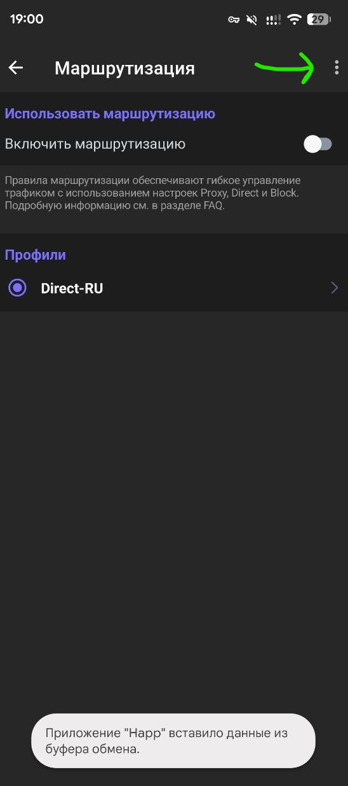 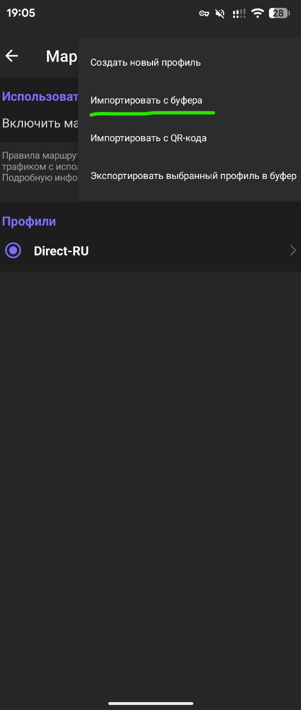

4) Далее включаем флажок, всё готово.

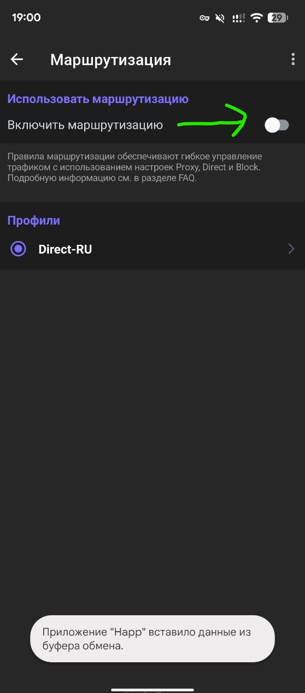

---
## Дополнительные возможности

По умолчанию все приложения на телефоне работают через VPN.

Но можно настроить **список приложений**, для которых VPN нужен — остальные будут ходить напрямую.

7) Заходим в **Настройки → Прокси для выбранных приложений**.

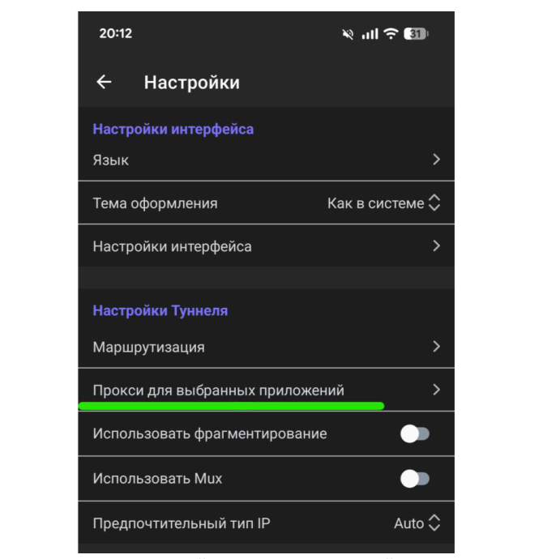

8) Проверяем, что включена **кнопка «ВКЛ»**.

Ставим галочки напротив приложений, которым нужен VPN (например, Chrome, Instagram и т.д.).

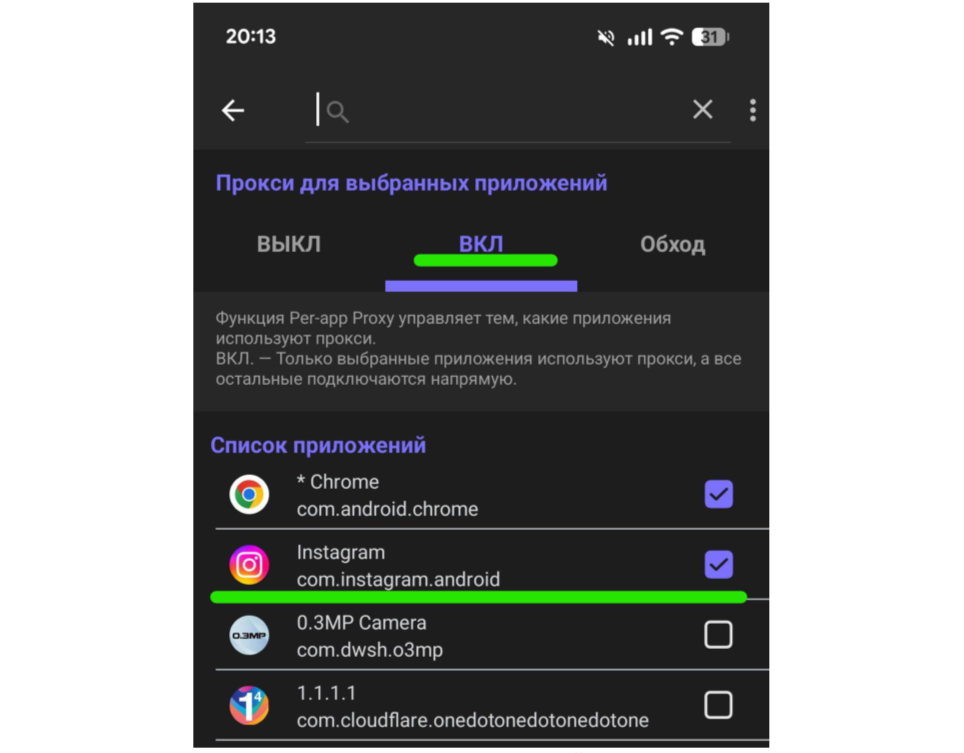

---
## Обновление подписки

Если админ сообщил, что на сервере что-то поменялось и подписку нужно обновить:

В настройках группы серверов нажимаем **«Обновить»** (🔄).

После обновления все конфиги восстановятся, даже если вы какие-то раньше удаляли.

---

🚫 **НЕ КАЧАТЬ ТОРРЕНТЫ СО ВКЛЮЧЁННЫМ VPN!**

🚫 **НЕЛЬЗЯ!** Вы будете нагружать канал!

🚫 **НЕЛЬЗЯ!** Вы будете нарушать закон об авторском праве!