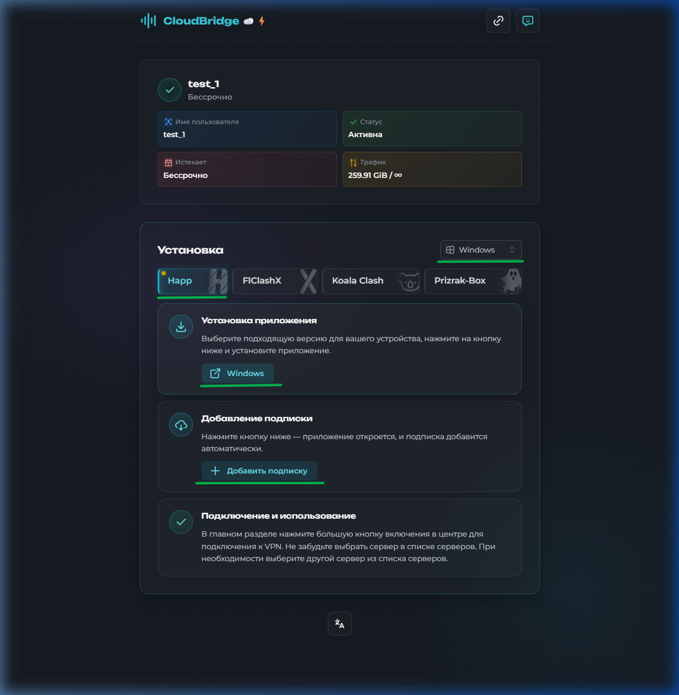
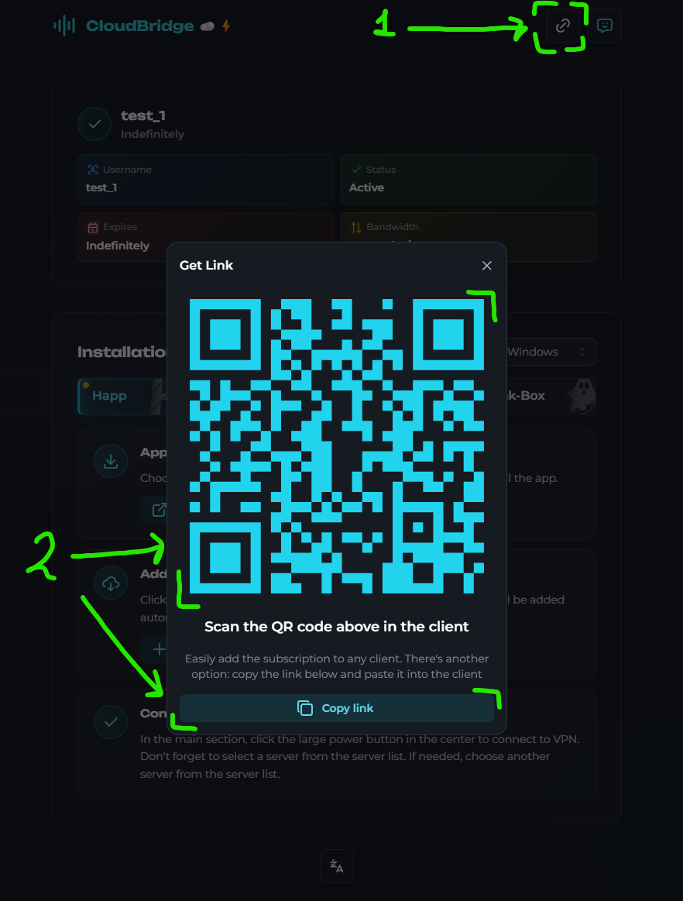
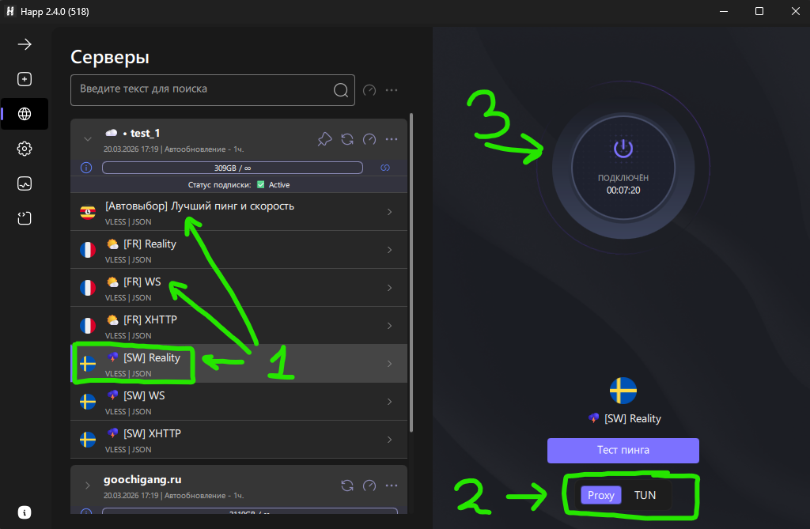
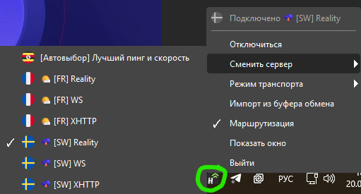
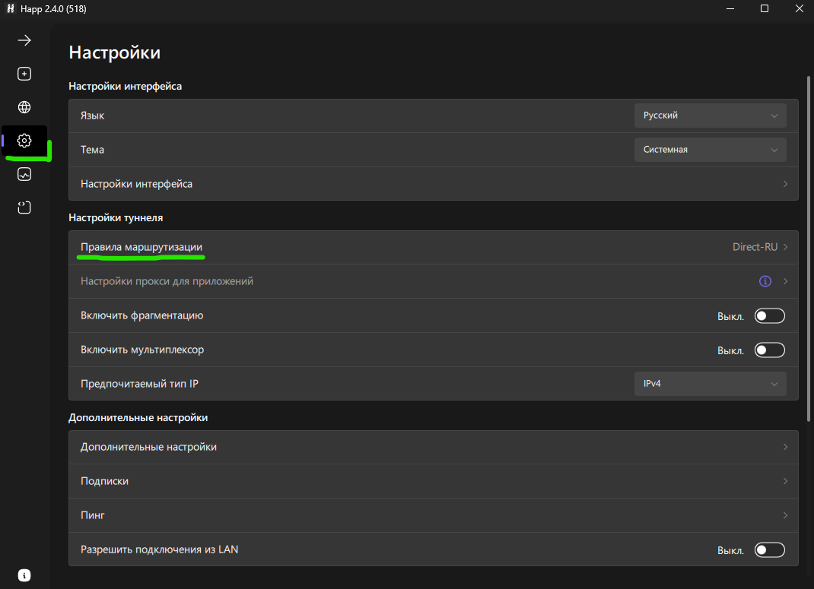
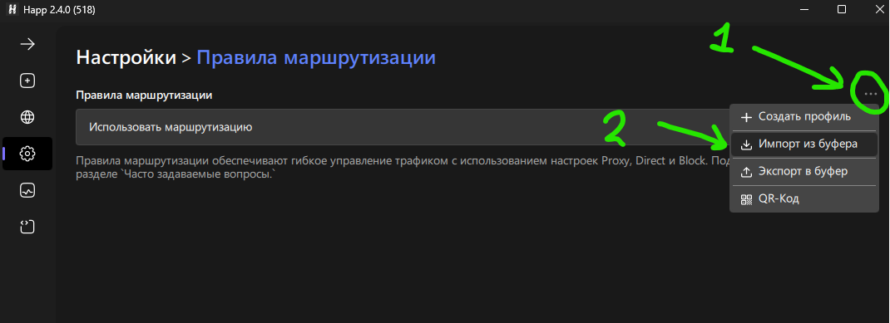
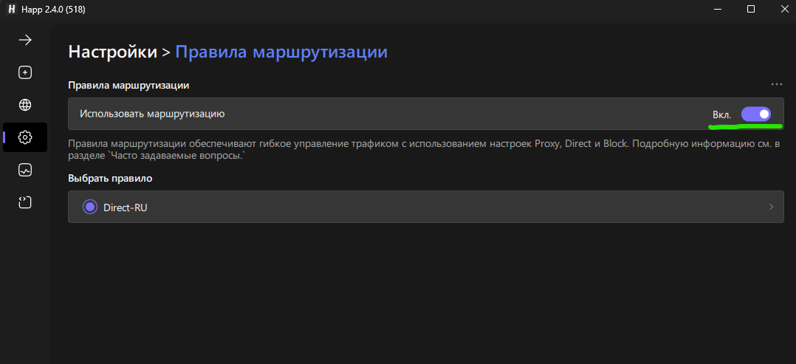
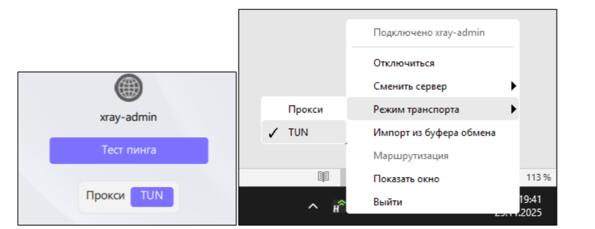
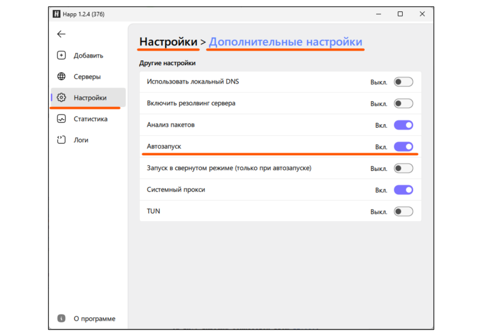

# Инструкция Windows Happ

1) Открываем **страницу подписки** remnavawe, которую вам скинул админ.

Пример ссылки: `https://webhooks.techbridge-net.com/ваш_код`

На странице вы увидите информацию о вашей подписке: имя пользователя, статус, срок действия и трафик.

> ⚠️ **Подписка рассчитана на 5 устройств.** Добавить её на шестое устройство не получится. Если нужно больше — обратитесь к админу.



2) В разделе **«Установка»** убедитесь, что выбрана платформа **Windows** (переключатель справа вверху).

Вкладка **Happ** должна быть активна.

Нажимаем кнопку **«Windows»** — скачается установщик.

3) Запускаем скачанный файл и устанавливаем **Happ**.

После установки нажимаем **«Завершить»**.

4) Запускаем **Happ**.

5) Теперь нужно добавить подписку.

Возвращаемся на **страницу подписки** remnavawe в браузере.

Находим раздел **«Добавление подписки»** и жмём кнопку **«+ Добавить подписку»**.

Happ откроется сам и подписка добавится **автоматически**.

> Если Happ не открылся — убедитесь, что он установлен и запущен. Попробуйте ещё раз.


> **Альтернативный способ:** скопируйте ссылку-подписку и в приложении Happ нажмите **«Из буфера»**. Либо можно отсканировать **QR‑код** кнопкой **«QR-Код»**.




6) После добавления подписки в списке серверов появятся доступные конфиги.

Вы увидите подключения по разным странам и протоколам, например:
- **[Автовыбор]** — автоматически выбирает лучший сервер, а если связь пропадёт — сам переключится на другой рабочий
- **[FR] Reality**, **[FR] WS**, **[FR] XHTTP** — серверы во Франции
- **[SW] Reality**, **[SW] WS**, **[SW] XHTTP** — серверы в Швеции
- и другие

**Рекомендуем использовать [Автовыбор]** — так вам не придётся вручную менять сервер, если один из них перестанет работать.

7) Выбираем нужный конфиг из списка и переключаем режим на **Прокси**.

**Запустить!** Нажимаем большую **кнопку включения** в центре.



*Можно подключиться из трея:* правой кнопкой мыши по значку Happ → **Подключиться**.
Сменить сервер тоже можно через трей.

8) После подключения на кнопке появится статус **«Подключён»**, а в трее возле иконки Happ — **зелёный индикатор**.



9) **ВАЖНО!** Проверьте, что в браузере **нет** расширения **«Доступ к Рутрекеру»**. Если есть — **удалите его**.

Оно конфликтует с режимом системного прокси в Happ. Заодно удалите любые другие расширения, связанные с прокси и VPN — они тоже могут мешать.

10) Проверяем, что VPN работает: заходим на [https://www.whatismyip.com/](https://www.whatismyip.com/) — страна должна быть **не Россия** (например, Франция, Швеция, Германия и т.д.).

11) Чтобы **отключить VPN** — нажимаем на ту же большую кнопку.

*Либо через трей: «Режим системного прокси» → «Отключить».*

---
## Можно сразу настроить маршрутизацию, чтоб ру-сайты, открывались напрямую:

**Функция экспериментальная, попробуйте, если не будет работать - просто отключите.**

1) Открываем правила маршрутизации:



2) Копируем на выбор одну из строк ниже.

**Только ру сайты напрямую:**
```happ://routing/add/ewogICAgIkJsb2NrSXAiOiBbXSwKICAgICJCbG9ja1NpdGVzIjogW10sCiAgICAiRGlyZWN0SXAiOiBbCiAgICAgICAgImdlb2lwOnJ1IiwKICAgICAgICAiMTAuMC4wLjAvOCIsCiAgICAgICAgIjE3Mi4xNi4wLjAvMTIiLAogICAgICAgICIxOTIuMTY4LjAuMC8xNiIsCiAgICAgICAgIjE2OS4yNTQuMC4wLzE2IiwKICAgICAgICAiMjI0LjAuMC4wLzQiLAogICAgICAgICIyNTUuMjU1LjI1NS4yNTUiCiAgICBdLAogICAgIkRuc0hvc3RzIjogewogICAgICAgICJjbG91ZGZsYXJlLWRucy5jb20iOiAiMS4xLjEuMSIKICAgIH0sCiAgICAiRG9tYWluU3RyYXRlZ3kiOiAiSVBJZk5vbk1hdGNoIiwKICAgICJEb21lc3RpY0ROU0RvbWFpbiI6ICJodHRwczovL2Rucy5nb29nbGUvZG5zLXF1ZXJ5IiwKICAgICJEb21lc3RpY0ROU0lQIjogIjc3Ljg4LjguOCIsCiAgICAiRG9tZXN0aWNETlNUeXBlIjogIkRvVSIsCiAgICAiRmFrZUROUyI6ICJmYWxzZSIsCiAgICAiR2VvaXB1cmwiOiAiaHR0cHM6Ly9naXRodWIuY29tL0xveWFsc29sZGllci92MnJheS1ydWxlcy1kYXQvcmVsZWFzZXMvbGF0ZXN0L2Rvd25sb2FkL2dlb2lwLmRhdCIsCiAgICAiR2Vvc2l0ZXVybCI6ICJodHRwczovL2dpdGh1Yi5jb20vTG95YWxzb2xkaWVyL3YycmF5LXJ1bGVzLWRhdC9yZWxlYXNlcy9sYXRlc3QvZG93bmxvYWQvZ2Vvc2l0ZS5kYXQiLAogICAgIkdsb2JhbFByb3h5IjogInRydWUiLAogICAgIkxhc3RVcGRhdGVkIjogMTc2NDMyMDc0MywKICAgICJQcm94eUlwIjogW10sCiAgICAiUHJveHlTaXRlcyI6IFtdLAogICAgIlJlbW90ZUROU0RvbWFpbiI6ICJodHRwczovL2Nsb3VkZmxhcmUtZG5zLmNvbS9kbnMtcXVlcnkiLAogICAgIlJlbW90ZUROU0lQIjogIjEuMS4xLjEiLAogICAgIlJlbW90ZUROU1R5cGUiOiAiRG9IIiwKICAgICJSb3V0ZU9yZGVyIjogImJsb2NrLWRpcmVjdC1wcm94eSIsCiAgICAiTmFtZSI6ICJEaXJlY3QtUlUiLAogICAgIkRpcmVjdFNpdGVzIjogWwogICAgICAgICJnZW9zaXRlOnByaXZhdGUiLAogICAgICAgICJnZW9zaXRlOmNhdGVnb3J5LXJ1IiwKICAgICAgICAiZ2Vvc2l0ZTpjYXRlZ29yeS1nb3YtcnUiLAogICAgICAgICJnZW9zaXRlOnlhbmRleCIsCiAgICAgICAgImdlb3NpdGU6bWFpbHJ1IiwKICAgICAgICAiZ2Vvc2l0ZTp2ayIsCiAgICAgICAgImRvbWFpbjpydSIsCiAgICAgICAgImRvbWFpbjp4bi0tcDFhaSIsCiAgICAgICAgImRvbWFpbjpzdSIsCiAgICAgICAgImRvbWFpbjp1ZmFuZXQudHYiCiAgICBdCn0=```

**Ру сайты и гугл напрямую:**
```happ://routing/add/ewogICAgIkJsb2NrSXAiOiBbXSwKICAgICJCbG9ja1NpdGVzIjogW10sCiAgICAiRGlyZWN0SXAiOiBbCiAgICAgICAgImdlb2lwOnJ1IiwKICAgICAgICAiMTAuMC4wLjAvOCIsCiAgICAgICAgIjE3Mi4xNi4wLjAvMTIiLAogICAgICAgICIxOTIuMTY4LjAuMC8xNiIsCiAgICAgICAgIjE2OS4yNTQuMC4wLzE2IiwKICAgICAgICAiMjI0LjAuMC4wLzQiLAogICAgICAgICIyNTUuMjU1LjI1NS4yNTUiCiAgICBdLAogICAgIkRuc0hvc3RzIjogewogICAgICAgICJjbG91ZGZsYXJlLWRucy5jb20iOiAiMS4xLjEuMSIKICAgIH0sCiAgICAiRG9tYWluU3RyYXRlZ3kiOiAiSVBJZk5vbk1hdGNoIiwKICAgICJEb21lc3RpY0ROU0RvbWFpbiI6ICJodHRwczovL2Rucy5nb29nbGUvZG5zLXF1ZXJ5IiwKICAgICJEb21lc3RpY0ROU0lQIjogIjc3Ljg4LjguOCIsCiAgICAiRG9tZXN0aWNETlNUeXBlIjogIkRvVSIsCiAgICAiRmFrZUROUyI6ICJmYWxzZSIsCiAgICAiR2VvaXB1cmwiOiAiaHR0cHM6Ly9naXRodWIuY29tL0xveWFsc29sZGllci92MnJheS1ydWxlcy1kYXQvcmVsZWFzZXMvbGF0ZXN0L2Rvd25sb2FkL2dlb2lwLmRhdCIsCiAgICAiR2Vvc2l0ZXVybCI6ICJodHRwczovL2dpdGh1Yi5jb20vTG95YWxzb2xkaWVyL3YycmF5LXJ1bGVzLWRhdC9yZWxlYXNlcy9sYXRlc3QvZG93bmxvYWQvZ2Vvc2l0ZS5kYXQiLAogICAgIkdsb2JhbFByb3h5IjogInRydWUiLAogICAgIkxhc3RVcGRhdGVkIjogMTc2NDMyMDc0MywKICAgICJQcm94eUlwIjogW10sCiAgICAiUHJveHlTaXRlcyI6IFtdLAogICAgIlJlbW90ZUROU0RvbWFpbiI6ICJodHRwczovL2Nsb3VkZmxhcmUtZG5zLmNvbS9kbnMtcXVlcnkiLAogICAgIlJlbW90ZUROU0lQIjogIjEuMS4xLjEiLAogICAgIlJlbW90ZUROU1R5cGUiOiAiRG9IIiwKICAgICJSb3V0ZU9yZGVyIjogImJsb2NrLWRpcmVjdC1wcm94eSIsCiAgICAiTmFtZSI6ICJEaXJlY3QtUlUrRyIsCiAgICAiRGlyZWN0U2l0ZXMiOiBbCiAgICAgICAgImdlb3NpdGU6cHJpdmF0ZSIsCiAgICAgICAgImdlb3NpdGU6Y2F0ZWdvcnktcnUiLAogICAgICAgICJnZW9zaXRlOmNhdGVnb3J5LWdvdi1ydSIsCiAgICAgICAgImdlb3NpdGU6eWFuZGV4IiwKICAgICAgICAiZ2Vvc2l0ZTptYWlscnUiLAogICAgICAgICJnZW9zaXRlOnZrIiwKICAgICAgICAiZG9tYWluOnJ1IiwKICAgICAgICAiZG9tYWluOnhuLS1wMWFpIiwKICAgICAgICAiZG9tYWluOnN1IiwKICAgICAgICAiZG9tYWluOnVmYW5ldC50diIsCiAgICAgICAgImdlb3NpdGU6Z29vZ2xlIgogICAgXQp9```

3) После копирования нажимаем на три точки, импорт из буфера:



4) Далее включаем флажок, всё готово.



---
## Важная информация



**Режим прокси** — VPN работает только для приложений, в которых настроен системный прокси (например, браузер).

**Режим TUN** — весь трафик на компьютере идёт через VPN.

**Используйте режим системного прокси!** Он работает **быстрее и стабильнее**.

Если в каком-то приложении или игре VPN в режиме прокси не помогает — только тогда включайте **TUN-режим**.

> **!!!** В режиме системного прокси работает **блокировка торрент-трафика** — это на случай, если забудете выключить VPN.

🚫 **НЕ КАЧАТЬ ТОРРЕНТЫ СО ВКЛЮЧЁННЫМ VPN!**

🚫 **НЕЛЬЗЯ!** Вы будете нагружать канал!

🚫 **НЕЛЬЗЯ!** Вы будете нарушать закон об авторском праве!

---
## Рекомендации



1) **Перенесите значок Happ** в основную панель трея, чтобы он всегда был на виду.

2) Включите **автозапуск Happ**: Настройки → Дополнительные настройки → Автозапуск → **Вкл**.

---
## Обновление подписки

Если админ сообщил, что на сервере что-то поменялось и нужно обновить подписку:

В списке серверов нажмите на иконку **«Обновить»** (🔄).

После обновления все конфиги восстановятся, даже если раньше вы какие-то удаляли.

